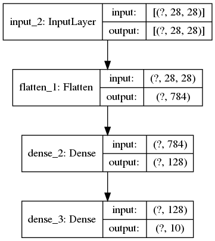

# Dense Neural Network using Tensorflow

* Build Model
* Download MNIST fashion data and pre-process
* Compile Model
    * Setup Tensorboard callback
    * Setup Checkpoints callback
* Train the model
* Evaluate accuracy
* Inference
* View weights and bias

## Model

## Training

Total parameters: ~102K
Explored **relu, swish** activation funcitons.

**Dataset** used: MNIST Fashion

With 10 epochs of training, accuracy obtained: 88.74%

## Toolchain
* python - 3.8.5
* tensorflow - 2.3.0
* cv2 - 4.1.2
* matplotlib - 3.3.2
* numpy - 1.19.2
* Used minconda or conda for virtual environment
